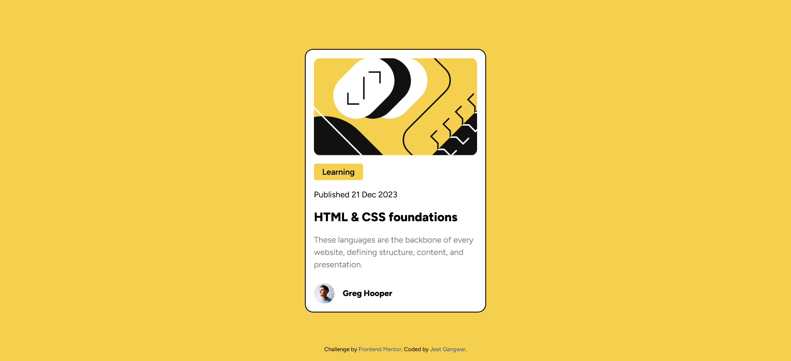

# Frontend Mentor - Blog preview card solution

This is a solution to the [Blog preview card challenge on Frontend Mentor](https://www.frontendmentor.io/challenges/
blog-preview-card-ckPaj01IcS). Frontend Mentor challenges help you improve your coding skills by building realistic projects.

## Table of contents

- [Overview](#overview)
  - [The challenge](#the-challenge)
  - [Screenshot](#screenshot)
  - [Links](#links)
- [My process](#my-process)
  - [Built with](#built-with)
- [Author](#author)

## Overview

### The challenge

Users should be able to:

- See hover and focus states for all interactive elements on the page

### Screenshot

### Links

- Solution URL: [Check Solution](https://github.com/i-amWin/blog-preview-card-Frontend_Mentor)
- Live Site URL: [See Live](https://i-amwin.github.io/blog-preview-card-Frontend_Mentor/)

## My process

### Built with

- Semantic HTML5 markup
- CSS custom properties
- Flexbox
- CSS Grid
- Mobile-first workflow
- [Tailwind CSS](https://tailwindcss.com/) - For styles

## Author

- Website - [Jeet Gangwar](https://jeets-portfolio.vercel.app/) (Not up to date)
- Frontend Mentor - [@i-amWin](https://www.frontendmentor.io/profile/i-amWin)
- Github - [@i-amWin](https://github.com/i-amWin)
